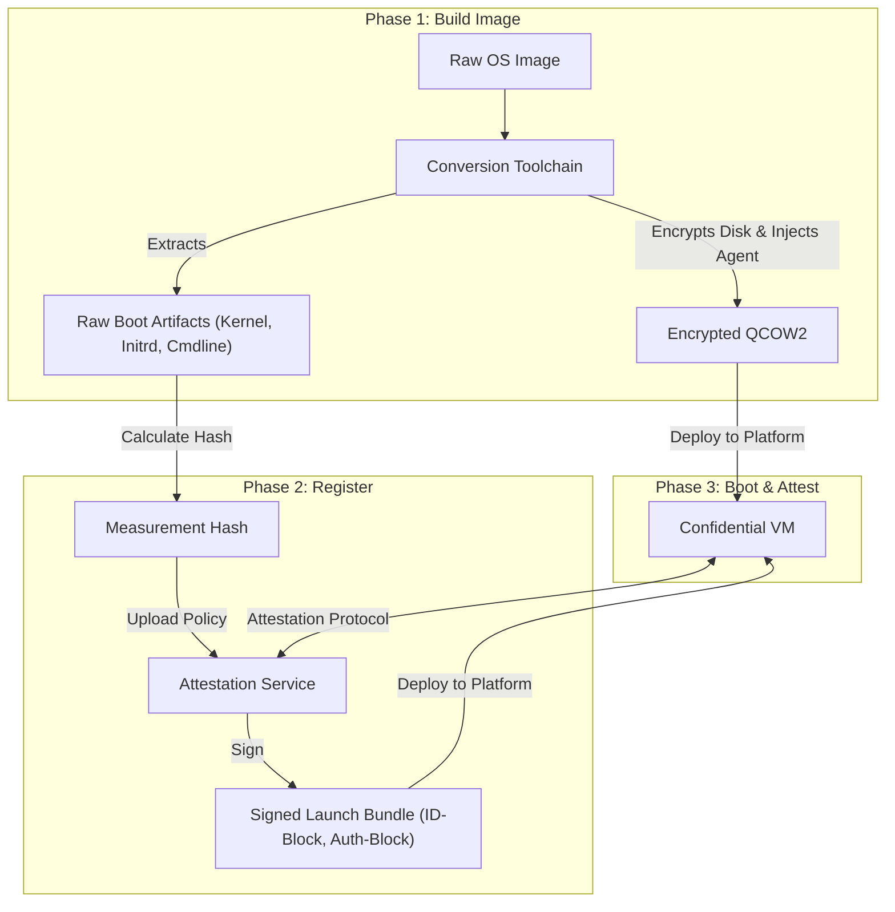

This document aims to provide a high-level architectural overview of AMD SEV-SNP Remote Attestation. It explains the theoretical challenges of booting confidential virtual machines (specifically the "Secure Bootstrapping Problem"), the cryptographic protocols required to solve them, and the necessary lifecycle for preparing and verifying trusted cloud images independently of the cloud provider.

---

## Table of Contents

1.  [The Core Problem: The Secure Bootstrapping Problem](#1-the-core-problem-the-secure-bootstrapping-problem)
2.  [Attestation Overview](#2-attestation-overview)
3.  [Architecture & Workflow](#3-architecture--workflow)
4.  [The Attestation Protocol (Step-by-Step)](#4-the-attestation-protocol-step-by-step)
5.  [Image Preparation & Measurement Theory](#5-image-preparation--measurement-theory)
6.  [Solution Lifecycle](#6-solution-lifecycle)
7.  [Implementation Reference](#implementation-reference)

---

## 1. The Core Problem: The Secure Bootstrapping Problem

In a standard cloud environment, tenants must trust the Cloud Service Provider (CSP) not to inspect VM memory or clone disks. Confidential Computing (AMD SEV-SNP) protects runtime memory via hardware encryption. However, it introduces a specific bootstrapping challenge.

1.  **The Secret:** The VM requires a Volume Master Key (VMK) to decrypt its root filesystem (LUKS) to boot.
2.  **The Risk:** This key cannot be baked into the disk image (as the CSP could read it from storage). It also cannot be requested over the network without proof of identity.
3.  **The Solution:** The VM must prove it is genuine, unmodified, and running inside a secure AMD SEV-SNP enclave *before* it receives the key. This process is called **Remote Attestation**.

---

## 2. Attestation Overview

AMD SEV-SNP hardware generates cryptographically signed attestation reports that serve as the "Identity Card" for the VM. An Attestation Service acts as a Key Broker, verifying these reports against a strict set of policies before releasing the disk encryption keys.

### The Attestation Report
The hardware report is not a simple status check. It contains specific cryptographic proofs:
* **Measurement:** A SHA-384 digest of the exact initial state (Firmware + Kernel + Initrd + Cmdline).
* **TCB Version:** The version numbers of the Bootloader, TEE, SNP Firmware, and Microcode.
* **Image ID:** A 16-byte identifier cryptographically bound to the measurement.
* **Key Digests:** Hashes of the ID-Block and Auth-Block keys used to sign the launch.
* **Report Data:** A 64-byte field allowing the VM to embed custom data (crucial for binding the communication channel).

---

## 3. Architecture & Workflow

The solution requires three distinct phases: **Build**, **Register**, and **Boot**.



---

## 4. The Attestation Protocol (Step-by-Step)

The protocol ensures that the key is released securely directly into the VM's private memory space. This requires an **Attestation Agent** running inside the VM's `initrd` (Initial Ramdisk).

### Step 1: Nonce Exchange
The Agent requests a fresh nonce from the Attestation Service.
* **Purpose:** Prevents "Replay Attacks," ensuring an attacker cannot capture a valid report from yesterday and use it to unlock the disk today.
* **Validation:** The service tracks the nonce and enforces an expiration window.

### Step 2: Report Generation & Binding
This is the critical step that binds the *Identity* (The VM) to the *Session* (The Network Connection).
1.  **Session Key:** The Agent generates an ephemeral encryption keypair (e.g., X25519).
2.  **Binding Hash:** The Agent computes a hash of the current context:
    ```text
    binding_hash = SHA512(server_nonce || client_public_key)
    ```
3.  **Hardware Request:** The Agent requests an attestation report from the AMD Secure Processor (`/dev/sev-guest`), injecting this `binding_hash` into the report's `report_data` field.

### Step 3: Server Verification
The Agent sends the **Report**, **Server Nonce**, **Client Public Key**, and the **Sealed VMK Blob** to the Service. The Service performs strict validation:

| Check | Description |
| :--- | :--- |
| **1. Structure** | Parses the binary to ensure it matches the AMD SEV-SNP specification. |
| **2. Nonce** | Verifies the nonce matches the one issued and is still valid. |
| **3. Binding** | Recalculates `SHA512(nonce || pub_key)` and confirms it exactly matches the `report_data` field in the report. This proves the report was generated *for this specific TLS session*. |
| **4. Measurement** | Look up the policy in the database using the report's `image_id`. Verify `report.measurement` matches the registered, trusted hash. |
| **5. TCB Check** | Ensures the hardware platform (Bootloader, TEE, Microcode) meets minimum security patch levels. |
| **6. VMPL Check** | **Critical:** Verifies `report.vmpl == 0`. This ensures the report was not spoofed by a nested hypervisor or lower-privilege component. |
| **7. Signature** | Verifies the hardware signature using the AMD VCEK/VLEK certificate chain (fetched from AMD Key Distribution Service). |

### Step 4: Secret Release
If all checks pass:
1.  **Unseal:** The Service uses its private key to decrypt the **Sealed VMK Blob** provided by the client.
2.  **Wrap:** The Service immediately re-encrypts the VMK using the **Client's Session Public Key** (HPKE).
3.  **Deliver:** The encrypted packet is returned to the Agent.

The Agent decrypts the key within the enclave memory and performs the disk unlock operation (e.g., `cryptsetup luksOpen`).

---

## 5. Image Preparation & Measurement Theory

### Why Image Preparation is Required
Standard cloud images cannot be used directly because:
1.  **Disk Encryption:** The root filesystem must be pre-encrypted with a key (VMK) that is unknown to the image creator.
2.  **Agent Injection:** The OS must know how to perform the attestation handshake. This requires injecting a custom binary and configuration into the boot path.

### The Initrd Artifacts
To facilitate the handshake, the `initrd` must be provisioned with three critical artifacts. The location of these files is irrelevant, but their presence is mandatory:
1.  **Attestation URL:** Where to send the report.
2.  **TLS CA Certificate:** To verify the identity of the Attestation Service (preventing Man-in-the-Middle attacks).
3.  **Sealed VMK:** An encrypted blob containing the disk key. This blob is encrypted with the *Attestation Service's Public Key*. The VM cannot decrypt it; it must send it to the service as part of the challenge.

### The Measurement Problem
The AMD SEV-SNP measurement is a cryptographic hash of the **exact** state of the VM at launch. This includes:
* Firmware Binary (OVMF)
* Kernel Binary
* Initrd Binary (with injected initrd artifacts mentioned above)
* Kernel Command Line Parameters

**Implication:** If the initrd is modified to include the artifacts mentioned above, the measurement changes. Therefore, the "Official Measurement" must be calculated **after** the agent and configuration are injected, but **before** the image is published.

---

## 6. Solution Lifecycle

To create a Confidential Computing-ready image, a toolchain must execute the following logical steps:

### 1. Conversion & Sealing
* **Encrypt:** The rootfs is encrypted with LUKS2 using a random VMK.
* **Seal:** The VMK is encrypted with the Service's Public Key and stored in the image configuration.
* **Inject:** The Attestation Agent is added to the initrd.

### 2. Registration
* The tool extracts the *final* kernel, initrd, and cmdline.
* It calculates the launch digest.
* It registers this digest as a "Trusted Policy" with the Attestation Service.

### 3. Launch
The Service generates the required launch artifacts (ID-Block and Auth-Block) signed with specific keys linked to the policy. The Cloud Provider uses these artifacts to instruct the AMD hardware to launch the specific, measured VM.

---

## Implementation Reference

This architecture, which includes the service, the image converter, and the initrd agent, is implemented in the **SnpGuard** project: [https://github.com/rouming/snp-guard](https://github.com/rouming/snp-guard)

**SnpGuard** provides the reference implementation for the image toolchain (`snpguard-image`), the policy server (`snpguard-server`), and the initrd agent (`snpguard-client`).
